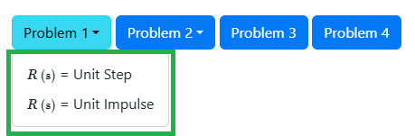
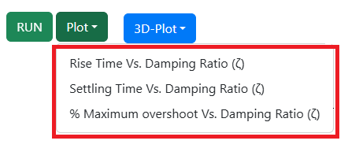
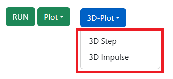
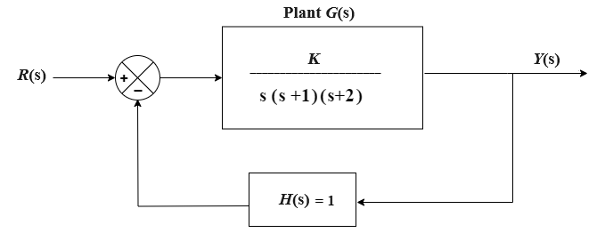
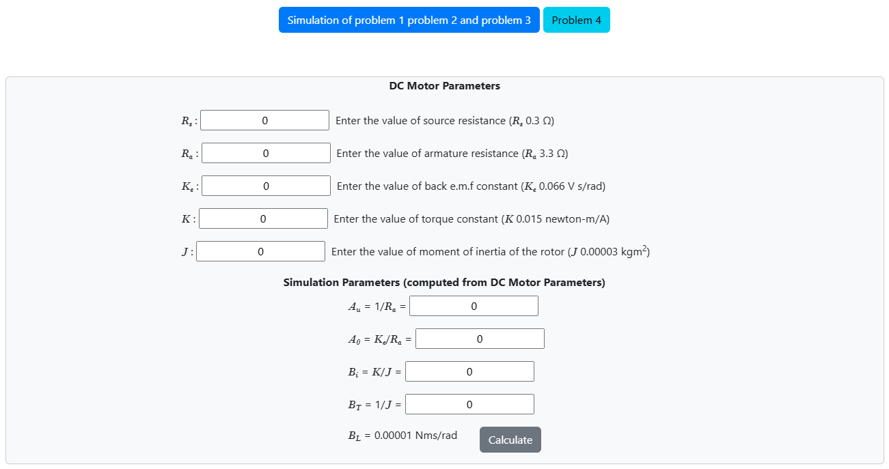
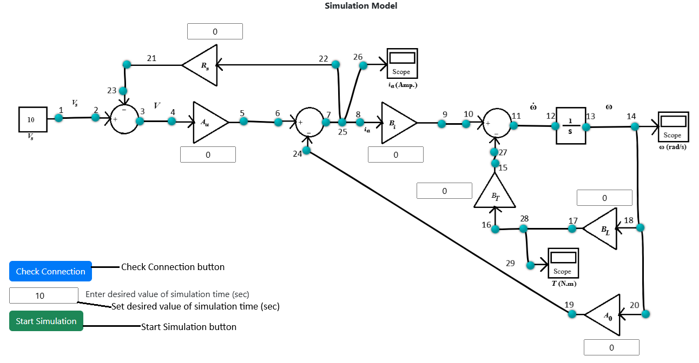
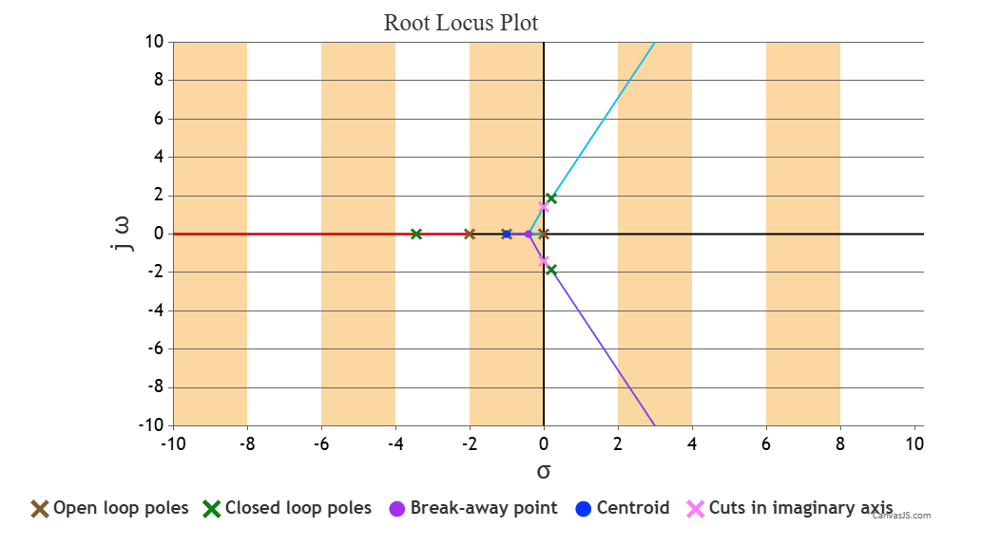
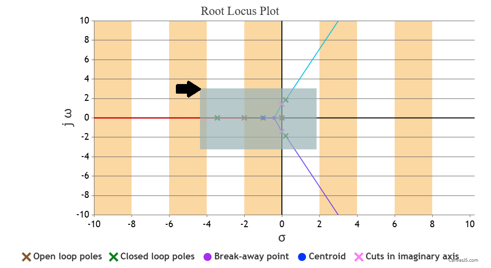
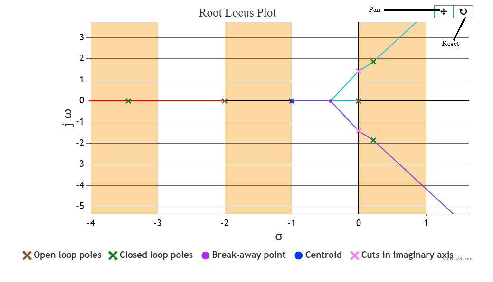

### Procedure

 
<b>Fig. 1. Unity negative feedback control system</b>								  

 

<b>Steps to perform the simuation</b> 
<ol type="1">

<b>Problem-1 (Observe the output response of a unity negative feedback system for different values of &zeta; = 0, 0.2, 0.4, 0.6, 0.8, 1.0 upto 10 sec for unit step and unit impulse input.)</b> 
<li><ul><li>First click on "Problem 1" button (Fig. 2) and select the input signal (Unit Step or Unit Impulse).</li>

 
<b>Fig. 2. Problem 1, Problem 2, Problem 3 and Problem 4 buttons on simulation page</b>								  

 
<li>In the given unity feedback system (Fig. 1), set the value of &zeta; (damping ratio) in the input box in the denominator of plant transfer function G (s).</li></ul></li> 

<li><ul><li>&zeta; can be varied for 0, 0.2, 0.4, 0.6, 0.8, 1.0.</li>
<li>After the value of &zeta; is set click on the 'RUN' button to observe the output response for the particular input signal and &zeta; value.</li>
<li>After changing the &zeta; value further, there will be one confirm message box for showing compared plots for different entered &zeta; values.</li>
<li>Check the 'Yes' option and click on 'OK' button at the bottom of the box. Compared plots for all &zeta; values chosen will be shown 
(&zeta; can be varied upto six values to observe compared plots).</li></ul></li> 

<li>Click on 'Download Plot' button to download the response plot. Click on 'Ok' button.</li> 

 
<b>Fig. 3. Plot button on simulation page</b>								  

 

<li><ul><li>Click on 'Plot' button then on 'Rise Time Vs. Damping Ratio (&zeta;)' to observe the Rise Time Vs. Damping Ratio (&zeta;) plot for all &zeta; values chosen where 0.4 &le; &zeta; &le; 1.</li>
<li>Click on 'Plot' button then on 'Settling Time Vs. Damping Ratio (&zeta;)' to observe the Settling Time Vs. Damping Ratio (&zeta;) plot for all &zeta; values chosen where &zeta; &gt; 0.</li>
<li>Click on 'Plot' button then on '% Maximum overshoot Vs. Damping Ratio (&zeta;)' to observe the % Maximum overshoot Vs. Damping Ratio (&zeta;) plot for all &zeta; values chosen.</li></ul></li> 

 
<b>Fig. 4. 3D-Plot button on simulation page</b>								  

 
<li><ul><li>Click on '3D-Plot' button then on either '3D Step' or '3D Impulse' (depending on the type of input signal, chosen in step 1)
to observe the 3D response plot for that particular input signal and  all the &zeta; values chosen.</li>
<li>Where x-axis represents time (sec), y-axis represents &zeta; (damping ratio) and z-axis represents the output response.</li>
<li>Hover on the plot area and click on the camera icon in the top right corner to download this 3D plot. Click on 'Ok' button.</li></ul></li> 

<li>Change the value of &zeta; and repeat step 2-4.</li> 			

</ol>
  

 
<b>Fig. 5. Unity negative feedback control system for Root Loci plot, Bode plot and Nyquist plot</b>				          

 
<ol>
<b>Problem-2 (Plot the root loci for the unity negative feedback system for K = 0 to 50 and Check output response of the given system for K = 0.4, 2, 6 and 12 for unit step and unit impulse input.)</b> 
<li><ul><li>First click on "Problem 2" button (Fig. 2) and select the input signal (Unit Step or Unit Impulse).</li>
<li>In the given unity negative feedback system (Fig. 5), set the value of K (amplifier gain) in the input box in numarator of plant transfer function G (s).</li></ul></li> 

<li><ul><li>K can be varied from 0 to 50.</li>
<li>After the value of K is set click on the 'RUN' button, then on 'Root Locus' to observe the root locus plot of the system for that K value.</li>
<li>The plot can be zoomed by following these steps: 

i) Place your cursor at the beginning of the area you want to select. 
ii) Press and hold the left mouse button. 
iii) Drag the cursor across the area you want to zoom. 
iv) Release the mouse button once you've selected the desired content. </li>

<li>Click on 'Ok' button to clear the plot.</li>
<li>Change the K value and follow step 2 to observe the root locus plot of the system for that K value.</li></ul></li>  

<li><ul>
<li>Enter the value of K 0.4 now.</li>
<li>Click on the 'RUN' button, then on 'Output Response' to observe the output response for the particular input signal chosen in step 1 and K value 0.4.</li>
<li>Change K to 2, 6 and 12 to check output response of the given system for the particular input signal chosen in step 1 and K value.</li>
<li>Input signal can be changed by clicking on 'Problem 2' button and selecting the desired input signal.</li>
<li>After changing the K value further there will be one confirm message box for showing compared output response plots for different entered K values.</li>
<li>Check the 'Yes' option and click on 'OK' button at the bottom of the box.</li>
<li>Compared output response plots for all K values chosen will be shown
(K can be varied upto four values to observe compared output response plots).</li></ul></li> 

<li>The plots can be downloaded by clicking on 'Download Plot' button. Click on 'Ok' button.</li> 		

</ol>
  

<ol>
<b>Problem-3 (Bode and Nyquist plot for the unity negative feedback system where the gain K = 2.)</b> 
<li><ul><li>First click on "Problem 3" button (Fig. 2) and enter the desired range for angular frequency &omega; in the
input box below the block diagram.</li>
<li>The plant transfer function G (s) is given (Fig. 5) where the gain K = 2.</li></ul></li> 

<li><ul><li>Click on the 'RUN' button, then on 'Bode Plot' to observe the Bode plot of G (s) H (s).</li>
<li>The plot can be zoomed by following these steps: 

i) Place your cursor at the beginning of the area you want to select. 
ii) Press and hold the left mouse button. 
iii) Drag the cursor across the area you want to zoom. 
iv) Release the mouse button once you've selected the desired content. </li>

<li>Click on 'Ok' button to clear the plot.</li>
<li>Similarly, click on the 'RUN' button, then on 'Nyquist Plot' to observe the Nyquist plot of G (s) H (s).</li></ul></li> 

<li>The plots can be downloaded by clicking on 'Download Plot' button. Click on 'Ok' button.</li> 

<li>Observe the gain margin, phase margin, gain crossover frequency and phase crossover frequency.</li> 

<li>Click on "Problem 4" button (Fig. 2) to proceed to the Problem 4 simulation.</li>

 	 
</ol>
  

 
<b>Fig. 6. DC Motor Parameters block for dc motor simulation model</b>

 

 
<b>Fig. 7. DC motor simulation model</b>

 
<ol>
<b>Problem-4 (System response of a Permanent Magnet DC Motor from the simulation model)</b> 
<li><ul>
<li>Enter the values of Rs (0.3 &ohm;), Ra (3.3 &ohm;), Ke (0.066 V s/rad), K (0.015 newton-m/A) and J (0.00003 kgm2) in the "DC Motor Parameters" block (Fig. 6).</li>
<li>Click on 'Calculate' button to calculate the values of simulation parameters Au, A0, Bi, BT. BL is taken as 0.00001 Nms/rad.</li>
<li>The experiment is done for Vs = 10 V. </li>
<li>The values of simulation parameters Au, A0, Bi, BT. BL
will be displayed in respective display boxes in the Simulation Model.</li></ul></li> 

<li>Obtain the simulation model (Fig. 7) by connecting the connection points (blue points) following the instructions below:
<ul><li><b>Note:</b> Example: connection point 1 - connection point 2 (drag the wire from connection point 1 by pressing left mouse button and release on connection point 2).</li>
<li>1-2, 3-4, 5-6, 7-25, 25-8, 9-10, 11-12, 13-14, 14-18, 17-28, 28-16, 15-27, 18-20, 19-24, 25-22, 21-23, 25-26, 28-29.</li></ul></li> 

<li><ul><li>Click on the 'Check Connection' button to verify whether the connection is proper or not.</li>
<li><b>Note:</b> Any wire connection can be deleted by clicking on the connected wire if required.</li>
<li>If alert message is shown as 'wrong connection', examine the established connections and click on the incorrectly linked wire to remove it.</li></ul></li> 

<li>Enter desired value of simulation time (sec) (10 &lt; simulation time &le; 1000).</li> 
<li>Click on 'Start Simulation' button.</li>

<li>Click on the Scope icons to observe individual response of speed (rad/s) vs. time (sec), the motor armature current (amp.) vs. time (sec), motor load torque (TL) (N-m) vs. time (sec).</li> 

<li>The plot can be downloaded by clicking on 'Download Plot' button. Click on 'Ok' button.</li> 

<li>Click on "Simulation of problem 1 problem 2 and problem 3" button (Fig. 6) to perform the Problem-1, Problem-2 and Problem-3 simulation again.</li> 
</ol>
  	

<b>Zoom instructions for Root Locus, Bode and Nyquist plots :</b> 
The plots can be zoomed by following these steps: 

i) Place your cursor at the beginning of the area you want to select. 

 
<b>Fig. 8. Plot view before zooming</b>

 

ii) Press and hold the left mouse button. 
iii) Drag the cursor across the area you want to zoom. 

 
<b>Fig. 9. Selecting an area on plot during zooming</b>

 

iv) Release the mouse button once you've selected the desired content. 
v)	Click on the 'Pan' icon, then press and hold the left mouse button to move the plot area while in zoomed view. 
vi)	Click on the 'Reset' icon to zoom out and return the plot to its original view. 

 
<b>Fig. 10. Plot view after zooming</b>

 

<link href="./simulation/css/cs.css" rel="stylesheet">

  