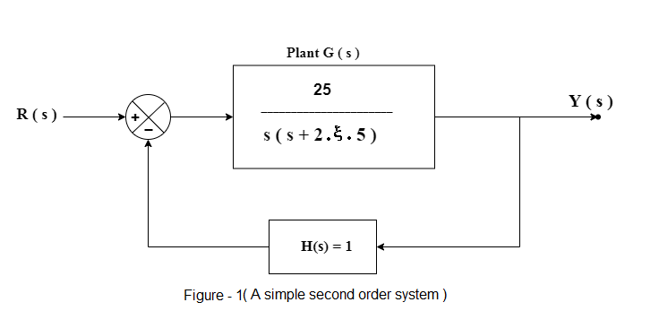
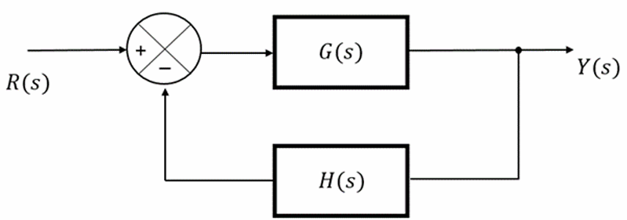
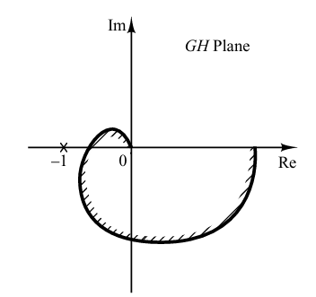
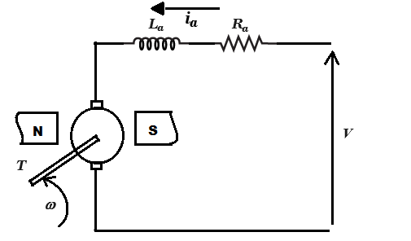
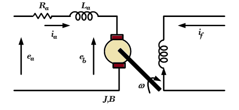
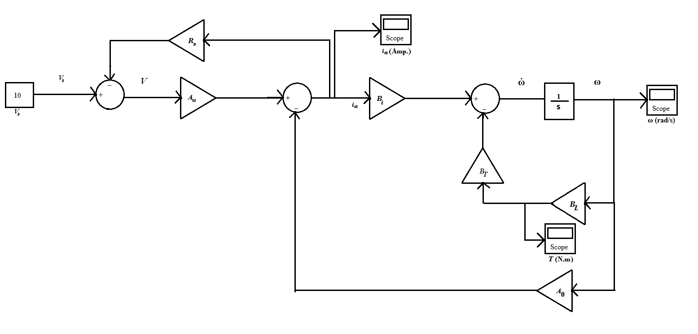

# Theory

In this experiment, the behaviour of some control systems will be analysed and simulation of their responses will be observed with the help of four problem statements.
  

<b>Problem 1</b> 

Observe the output response of a unity negative feedback system (Fig. 1) for different values of damping ratio (&zeta; = 0, 0.2, 0.4, 0.6, 0.8, 1.0) upto 10 sec when the inputs applied to the system are the unit step and unit impulse.
Plot its rise time, settling time and percentage maximum over shoot for different values of &zeta; for step input. Also plot three dimensional diagram of unit step and unit impulse response curves of the given system 
(taking x-axis as time (t), y-axis as &zeta; and z-axis as an output response).
 

				
 
<b>Fig. 1. A simple second order system</b>

 

<b>Unity negative feedback system</b> 

 
				
  
<b>Fig. 2. Block diagram of a negative feedback transfer function</b>

 

If the output or some part of the output is returned to the input side and utilized as part of the system input, then it is known as feedback. Feedback plays an important role in improving the 
performance of control systems.
Negative feedback reduces the error between the reference input R(s) and system output. The above figure (Fig. 1) shows the block diagram of the negative feedback control system.
Since H(s) = 1,  it is known as a unity negative feedback system. 
Transfer function of a negative feedback control system is,

$$T(s) = \frac{G(s)}{1 + G(s)H(s)}$$

where, 

T(s) is the transfer function of a closed loop system (or the overall feedback control system). 

G(s) is the plant transfer function or forward path transfer function. 

H(s) is the feedback transfer function. 

G(s)H(s) is called the open loop transfer function. 

 

<b> Second order system</b> <!--step response eqn. from ogata pp-166-168, Impulse response eqn. ogata pp-178--->

The open loop transfer function of a second order unity negative feedback system is given by,

$$G(s) =  \frac{\omega_{n}^2}{s ( s + 2 \zeta \omega_n )}$$

The closed loop transfer function of a second order unity negative feedback system is given by,

$$\frac{Y(s)}{R(s)} = \frac{G(s)}{1 + G(s)} = \frac{\omega_{n}^2}{s^2 + 2 \zeta \omega_n s + \omega_{n}^2}$$

where, 

R(s) = Laplace transform of the input signal r(t), 

Y(s) = Laplace transform of the output signal y(t), 

&zeta; = Damping ratio, 

&omega;n = Natural frequency of oscillation.  

The characteristic equation of the second order system is given by equating the denominator of the closed loop transfer function to zero.

$$( s^2 + 2 \zeta \omega_n s + \omega_{n}^2 ) = 0$$

The expression for the response of the second order system can be written as,

$$Y(s) = \frac{ \omega_{n}^2 }{ s^2 + 2 \zeta \omega_n s + \omega_{n}^2 } R(s) \tag{1}$$

When &zeta; = 0, the system is undamped. 

When &zeta; = 1, the system is critically damped. 

When 0 < &zeta; < 1, the system is underdamped. 

<!-- When &zeta; > 1, the system is  overdamped.  --> 

<b>Unit step response of second order system</b> 

Apply unit step signal at the input of the second order system, 

$$r(t) = u(t)$$

Taking laplace transform on the both sides 

$$R(s) = \frac{1}{s}$$

<b>Case 1 : when &zeta; = 0  i.e. system is undamped</b> 

The equation 1 becomes,

$$Y(s) = \frac{\omega_{n}^2}{s^2 + \omega_{n}^2} R(s)$$

Substituting 

$$R(s) = \frac{1}{s}$$

$$Y(s) = \frac{\omega_{n}^2}{s ( s^2 + \omega_{n}^2 )} $$

Taking the inverse laplace transform on both the sides, we have,

$$y(t) = ( 1 - cos ( \omega_n t )) \ u(t) \tag{2}$$

Equation (2), shows that the unit step response of an undamped system is a signal which oscillates periodically with frequency &omega;n and an offset of 1, never settling to a single final value.  

<b>Case 2 : when &zeta; = 1  i.e. system is critically damped</b> 

The equation 1 becomes,

$$Y(s) = \frac{\omega_{n}^2}{s^2 + 2 \omega_n s + \omega_{n}^2} R(s) = \frac{\omega_{n}^2}{( s + \omega_{n} )^2} R(s)$$

Substituting

$$R(s) = \frac{1}{s}$$

$$Y(s) = \frac{\omega_{n}^2}{ s (s + \omega_{n} )^2 } $$

After the partial fraction, taking the inverse laplace transform on both the sides, we have,

$$y(t) = ( 1 - e^{- \omega_n t} -  \omega_n t e^{- \omega_n t} ) \ u(t) \tag{3}$$

When the system is critically damped then, the equation (3) shows, that the unit step response of the second order system would try to reach the steady state step input. 

$$For \ t \to \infty, \ y(t) = u(t)$$

  

<b>Case 3 : when 0 < &zeta; < 1  i.e. system is underdamped</b> 

The equation 1 can be written as,

$$Y(s) = \frac{\omega_{n}^2}{(( s + \zeta \omega_{n} )^2 + \omega_{n}^2 ( 1 - \zeta^2 ))} R(s)$$

Substituting

$$R(s) = \frac{1}{s}$$

$$Y(s) = \frac{\omega_{n}^2}{s (( s + \zeta \omega_{n} )^2 + \omega_{n}^2 ( 1 - \zeta^2 ))} $$

After the partial fraction, taking the inverse laplace transform on both the sides, we have,

$$y(t) = \left( 1 - \frac{e^{- \zeta \omega_n t}}{\sqrt{1 - \zeta^2}} sin ( \omega_n \sqrt { 1 - \zeta^2 } \ t + \phi)\right) \ u(t), \ where \ \phi =  cos^{(-1)}\zeta\tag{4}$$

Equation (4) shows that when the system is underdamped, its unit step response exhibits oscillations whose amplitude decreases over time. 
In other words, the system’s output oscillates but the oscillations gradually diminish until the response settles.  

<b>Rise Time (time to rise from 10% to 90% of final value):</b> 

$$T_r = \frac{2.16 \zeta + 0.6}{\omega_n}, \ valid \ for \ (0.3 \leq \zeta \leq 1) \tag{5}$$

<b>Settling Time (to within 2% of final value):</b> 

$$T_s = \frac{4}{\zeta \omega_n} \tag{6}$$

<b>Percent maximum overshoot:</b> 

$$P.O = e^{\frac{-\zeta \pi}{\sqrt{1 - \zeta^2}}} \times 100 \tag{7}$$

<!-- <b>Case 4 : when &zeta; > 1  i.e. system is overdamped</b> <!-----OGATA PP-168-----

In this case, the two poles of equation 1 are negative real and unequal. 

Substituting

$$R(s) = \frac{1}{s}$$

The equation 1 can be written as, 

$$Y(s) = \frac{\omega_{n}^2}{(s + \zeta \omega_{n} + \omega_{n} \sqrt {\zeta^2 - 1})(s + \zeta \omega_{n} - \omega_{n} \sqrt {\zeta^2 - 1})s}$$

The inverse Laplace Transform will be,

$$y(t) = 1 + \frac{\omega_n}{2 \sqrt{\zeta^2 -1}} \left(\frac{e^{- s_1 t}}{s_1} - \frac{e^{- s_2 t}}{s_2}\right) \ for \ t\ge0 \tag{5}$$

where 

$$s_1 = (\zeta + \sqrt{\zeta^2 - 1})\omega_n \ and \ s_2 = (\zeta - \sqrt{\zeta^2 - 1})\omega_n$$

Thus, the response (Eqn. 5) includes two decaying exponential terms. -->  

<b>Unit impulse response of second order system</b> 

Apply unit impulse signal at the input of the second order system, 

$$r(t) = \delta(t)$$

Taking laplace transform on the both sides 

$$R(s) = 1$$

The expression for the response of the second order system for unit impulse input can be written as,

$$Y(s) = \frac{ \omega_{n}^2 }{ s^2 + 2 \zeta \omega_n s + \omega_{n}^2 } \tag{8}$$

After the necessary calculations, taking inverse laplace on both the sides, we get, 

<b>Case 1 : when &zeta; = 0  i.e. system is undamped</b> 

$$y(t) = \omega_n  sin ( \omega_n t)  \ for \ t  \ \geq \ 0 \tag{9}$$

<b>Case 2 : when &zeta; = 1  i.e. system is critically damped</b> 

$$y(t) = \omega_{n}^2 t e^{- \omega_n t} \ for \ t \ \geq \ 0 \tag{10}$$

<b>Case 3 : when 0 < &zeta; < 1  i.e. system is underdamped</b> 

$$y(t) = \frac{ \omega_n e^{- \zeta \omega_n t}}{\sqrt{(1 - \zeta^2)}} sin ( \omega_n \sqrt {( 1 - \zeta^2 )} \ t ) \ for \ t \ \geq \ 0 \tag{11}$$

<!-- <b>Case 4 : when &zeta; > 1  i.e. system is overdamped</b> 

$$y(t) = \frac{\omega_n}{2 \sqrt{\zeta^2 - 1}} (e^{-s_1 t} - e^{-s_2 t}) \ for \ t \ \geq \ 0 \tag{10}$$

where 

$$s_1 = (\zeta - \sqrt{\zeta^2 - 1})\omega_n \ and \ s_2 = (\zeta + \sqrt{\zeta^2 - 1})\omega_n$$ -->

  

<b>Problem 2</b> <!--------OGATA PP-273 SAME EXAMPLE---->

Plot the root loci for the unity negative feedback system given in Fig. 1. where,
$$G( s ) = K G_1( s ) = \frac{K}{s ( s + 1 )( s + 2 )}$$
Assume that the amplifier gain (K) is varied from 0 to 50 (We assume that the value of gain K is nonnegative.). 
Indicate the value of the gain K for which the root locus crosses the imaginary axis. Plot the output response for K = 0.4, 2,
6 and 12 when the inputs are unit step and unit impulse.

 
The characteristic equation of the system (considered in problem-2) is 
$$1 + K \ G_1(s) H(s) = 0 \tag{12}$$

The root locus is the path of the roots of characteristic equation traced out in s-plane as gain K is changed from 0 to &infin; and it is symmetrical about the real axis.
 

<b>Construction of Root Locus when K &ge; 0 and the system is a negative feedback system</b> 
<b>Branch</b> 
The root locus branches start at the open loop poles and end at open loop zeros. So, the number of root locus branches N is equal to the number of finite open loop poles P or the number of finite open loop zeros Z, whichever is greater.

Mathematically, the number of root locus branches N can be written as

$$N = P \tag{13}$$

when 

$$P\geq Z$$

$$N = Z \tag{14}$$

when 

$$Z\gt P$$

<!-- If the angle of the open loop transfer function at a point is an odd multiple of 180&deg;, then that point is on the root locus.--> 
If odd number of open loop poles and zeros exist to	the left side of a point on the real axis, then that point is on the root locus branch.  

<b>Centroid (<i>&alpha;</i>)</b> 

$$\alpha = \frac{\sum{Real \ part \ of \ finite \ open \ loop \ poles} - \sum{Real \ part \ of \ finite \ open \ loop \ zeros}}{P - Z} \tag{15}$$

<b>Angle of asymptotes (&theta;)</b>

$$\theta = \frac{(2q + 1)180^\circ}{P - Z} \tag{16}$$

where q = 0, 1, 2,...(P-Z)-1 

  <b>Break-away and Break-in points</b> 
If there exists a real axis root locus branch between two open loop poles, then there will be a break-away point in between these two open loop poles.
If there exists a real axis root locus branch between two open loop zeros, then there will be a break-in point in between these two open loop zeros. 

<!-- Note : Break-away and break-in points exist only on the real axis root locus branches. -->
 				

Steps to find break-away and break-in points 

1) Write K in terms of s from the characteristic equation (equation 12). 

2) Differentiate K with respect to s and make it equal to zero. Substitute these values of s in the above equation (found from step 1). 

3) The values of s for which the K value is positive are the break points.

  

<b>Problem 3</b> 
Check the stability of the unity negative feedback system given in Fig.1. where,

$$G ( s ) = \frac{2}{s ( s + 1 )( s + 2 )}, \ H ( s ) = 1$$

by drawing the Bode and Nyquist diagrams and hence indicate gain margin, phase margin, gain crossover frequency, phase crossover frequency.
  
<!-- Nyquist plots are used to draw the complete frequency response of the open loop transfer function. 

If P = Number of  open loop poles in the the right half of the s-plane and Z =  Number of  closed loop poles in the the right half of the s-plane then  
the number of encirclements N can be written as,

$$N = P - Z \tag{14}$$

The open loop control system is stable if there is no open loop pole in the the right half of the s-plane.
$$P = 0 ; N = -Z$$

The closed loop control system is stable if there is no closed loop pole in the right half of the s-plane.
$$Z = 0 ; N = P$$

<b>General steps for drawing Nyquist plots</b> 

i) Locate the poles and zeros of open loop transfer function G(s)H(s) in s plane. 

ii)	Draw the polar plot by varying &omega; (angular frequency) from zero to infinity. If pole or zero present at s = 0, then varying &omega; from 0+ to infinity for drawing polar plot. 

iii) Draw the mirror image of above polar plot for values of &omega; ranging from −&infin; to zero (0− if any pole or zero present at s = 0). 

iv)	The infinite radius half circle will start at the point where the mirror image of the polar plot ends and this infinite radius half circle will end at the point where the polar plot starts. 

v)	After drawing the Nyquist plot, we can find the stability of the closed loop control system using the Nyquist stability criterion.
If the critical point (-1+j0) lies outside the encirclement, then the closed loop control system is absolutely stable.   -->

<!--NEWLY ADDED THEORY ON NYQUIST PLOT FROM OGATA pp-451---->
<b>Nyquist Stability Criterion</b> 
This criterion can be expressed as 

$$Z = N + P \tag{17}$$

where, 
Z =  number of zeros of 1+G(s)H(s) in the right-half s plane 
N =  number of clockwise encirclements of the –1+j0 point 
P =  number of poles of G(s)H(s) in the right-half s plane
  
If P is not zero, for a stable control system, we must have Z=0,or N= – P, 
which means that we must have P counterclockwise encirclements of the –1+j0 point. If G(s)H(s)
does not have any poles in the right-half s plane, then Z = N. Thus, for stability there must be no encirclement of the –1+j0 point by the 
G(j&omega;)H(j&omega;) locus.  

The stability of such a system can be determined by seeing if the –1 + j0 point is enclosed by the Nyquist plot of G(j&omega;)H(j&omega;).
Let us assume the region enclosed by a Nyquist plot, shown in Fig. 3. For stability, the –1 + j0 point must lie outside the shaded region.  

				
  
<b>Fig. 3. Region enclosed by a Nyquist plot</b>

 

<!----CAN BE ADDED SOME NOTES IF REQUIRED LIKE STEPS TO DRAW NYQUIST--------->

<b>Stability Analysis using Nyquist Plots </b> 
From the Nyquist plots, we can identify whether the control system is stable, marginally stable or unstable based on the values of the following parameters. 

Gain crossover frequency (&omega;gc) and phase crossover frequency (&omega;pc). 
Gain margin (GM) and phase margin (PM)  

<b>Phase crossover frequency (&omega;pc)</b> 
The frequency at which the Nyquist plot intersects the negative real axis (phase angle is 180&deg;) is known as the phase crossover frequency. It is denoted by &omega;pc.  

<b>Gain crossover frequency (&omega;gc)</b> 
The frequency at which the Nyquist plot is having the magnitude of one is known as the gain crossover frequency. It is denoted by &omega;gc.  

The stability of the control system based on the relation between phase crossover frequency and gain crossover frequency is discussed below (the 
open-loop transfer function is considered as minimum phase (in other words open-loop poles and zeros are in the left half of complex plane)).  

i) If the phase crossover frequency (&omega;pc) is greater than the gain crossover frequency (&omega;gc), then the system is stable. 

ii) If the phase crossover frequency (&omega;pc) is equal to the gain crossover frequency (&omega;gc), then the system is marginally stable. 

iii) If phase crossover frequency (&omega;pc) is less than gain crossover frequency (&omega;gc), then the system is unstable. 

 <b>Gain Margin</b> 

The gain margin (GM) is equal to the reciprocal of the magnitude of the Nyquist plot at the phase crossover frequency.

$$GM = \frac{1}{M_{pc}} \tag{18}$$
where, Mpc is the magnitude in normal scale at the phase crossover frequency. 

 <b>Phase Margin</b> 
The phase margin (PM) is equal to the sum of 180&deg; and the phase angle at the gain crossover frequency.

$$PM = 180^\circ + \phi_{gc} \tag{19}$$
where, &phi;gc is the phase angle at the gain crossover frequency.  

The stability of the control system based on the relation between the gain margin and the phase margin is discussed below (the 
open-loop transfer function is considered as minimum phase (in other words open-loop poles and zeros are in the left half of complex plane)).  

i) If the gain margin (GM) is greater than one and the phase margin (PM) is positive, then the control system is stable. 

ii) If the gain margin (GM) is equal to one and the phase margin (PM) is zero degrees, then the control system is marginally stable. 

iii) If the gain margin (GM) is less than one and / or the phase margin (PM) is negative, then the control system is unstable. 

 <b>Bode Plot</b> 
The Bode plot or the Bode diagram consists of two plots :- 

1. Magnitude plot 
2. Phase plot 

In both the plots, x-axis represents angular frequency (logarithmic scale). whereas, yaxis represents the magnitude (linear scale) of open loop transfer function in the magnitude plot and the phase angle (linear scale) of the open loop transfer function in the phase plot.

The magnitude of the open loop transfer function in dB is -

$$M = 20 \ log \ |G ( j \omega ) H ( j \omega )| \tag{20}$$

The phase angle of the open loop transfer function in degrees is -

$$\phi = \angle G ( j \omega ) H ( j \omega ) \tag{21}$$

Note − The base of logarithm is 10.

  
<b>Problem 4</b> 
Obtain the system response of a permanent magnet dc motor (Fig. 4) from the simulation model (Fig. 6). Observe speed of the motor (&omega;), armature current (ia) and load torque (T).
Assume J is the inertia of the motor, b is the viscous friction coefficient, V is the supply voltage and motor is running without load.				

				
 
<b>Fig. 4. A shunt dc motor diagram</b>

 

where, &omega; : Speed (rad/sec) of the motor. 
ia : Armature current (amp.) 				
Ra : Armature resistance (ohms) 
La : Armature inductance (henry) 
T : Load torque (newton-m) 
V : Supply voltage (volts) 

<!-- <b>DC Motor model</b> 

Let us assume a general schematic diagram of a dc motor, shown in Fig. 5. Assume the following notations are used. 

				
 
<b>Fig. 5. Schematic diagram of dc motor</b>

 

ea : Armature voltage (volts) 
ia : Armature current (amp.) 
Ra : Armature resistance (ohms) 
La : Armature inductance (henry) 
eb : Back emf (volts) 
if : Field current (amp.) 
TM : Motor torque (newton-m) 
TL : Load torque (newton-m) 
&omega; : Speed (rad/sec) 
J : Moment of inertia of the rotor (newton-m/rad/sec2) 
B : Viscous friction coefficient (newton-m/rad/sec) 
KT : Torque constant 
Kb : Back emf constant 

  Upper case notations Ea, Ia, Eb, If
are used for steady state values of the respective
variables ea, ia, eb and if				
 
In the present setup a permanent magnet dc motor is used, the field winding is thus absent and the air gap flux is constant. 
The input drive may therefore be applied to the armature only, i.e. only armature controlled operation is possible.
The mathematical equations in this operating mode are, 

$$T_{M} = K_{T} I_a \tag{22}$$

$$e_{b} = K_{b} \omega \tag{23}$$

Armature circuit model

$$L_a\frac{di_a}{dt} + R_a i_a + e_b = e_a \tag{24}$$

Mechanical model

$$J\frac{d\omega}{dt} + B\omega + T_L = T_M \tag{25}$$

Taking Laplace Transform of (24) and (25),

$$\frac{\omega(s)}{E_a(s)} = \frac{K_T}{(sL_a + R_a)(sJ + B) + K_T K_b} \tag{26}$$

Assuming the inductance of the armature circuit to be very small, the motor transfer function may be written as, 

$$G_M(s) = \frac{\omega(s)}{E_a(s)} = \frac{K_T/R_a}{Js + B + \frac{K_T K_b}{R_a}} = \frac{K_M}{s\tau_m + 1}   \tag{27}$$

Motor gain constant (KM)

$$K_M = \frac{K_T}{R_a B + K_T K_b}$$

Motor time constant (&tau;m)

$$\tau_m = \frac{R_a J}{R_a B + K_T K_b}$$

The armature controlled motor therefore has a first order type-0 transfer function and the two constant KM and &tau;m
depend upon motor parameters.   -->

<b>DC motor simulation model</b> 

				
 
<b>Fig. 6. Simulation model of dc motor</b>

 

<b>Dynamic equations:</b> 

Mechanical part:

$$J \dot{\omega} = T_r - b \omega - T \tag{22}$$

Eletrical part:

$$V = L_a i_a + R_a i_a + E_b \tag{23}$$

ia : Armature current (amp.) 
Ra : Armature resistance (ohms) 
La : Armature inductance (henry) 
T : Load torque (newton-m) 
&omega; : Speed (rad/sec) 
La : Armature inductance (henry) 
V : Supply voltage (volts) 
J :Inertia of the motor (kgm2) 

Tr = developed torque = K ia, K = Torque constant 
Eb = Ke &omega; = back e.m.f, Ke = back e.m.f constant,
b : Viscous friction coefficient. 

Most DC motors have a negligible La such that La = 0. After eliminating internal variables Tr
and Eb the following equations can be obtained.

$$i_a = \frac{1}{R_a} V - \frac{K_e}{R_a} \omega = A_u V - A_0 \omega \tag{24}$$

$$\dot{\omega} = \frac{K}{J} i_a - \frac{b}{J} \omega - \frac{1}{J} T \tag{25}$$

$$\dot{\omega} = B_i i_a - B_0 \omega - B_T T \tag{26}$$

The parameters are given below: 

K = 0.015 newton-m/A, Ke = 0.066 V s/rad, Ra = 3.3 &ohm;, 
b = 0 and J = 30 &times; 10-6 kgm2
such that Au = 0.303, A0 = 0.02, Bi = 500, 
B0 = 0 and 
BT = 33333.

The motor assumed supplied from a voltage source, modeled by the following equation

$$V = V_s - R_s i_a \tag{27}$$

where Vs = 10 V and Rs = 0.3 &ohm;. The load is assumed a pure viscous load, represented by a load torque equation

$$T = B_L \omega \tag{28}$$

BL = 0.00001 Nms/rad.

<link href="./simulation/css/cs.css" rel="stylesheet">			    
						
								
