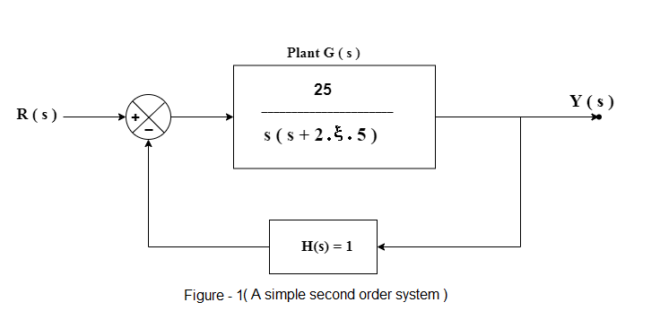

# Theory

 In this experiment, the behaviour of some control systems will be analysed and simulation of their responses will be observed with the help of four problem statements.
              
			   
<b>Problem 1:</b>

Observe the system response of a unity feedback system (Figure-1) and its rise time, settling time and percentage over shoot for different values of &zeta;( damping ratio ).

				

<b>Unity feedback system:</b>

If the output or some part of the output is returned to the input side and utilized as part of the system input, then it is known as feedback. Feedback plays an important role in order to improve the performance of the control systems.
Negative feedback reduces the error between the reference input R(s) and system output. The above figure ( Figure 1 ) shows the block diagram of the negative feedback control system.
Since H( s ) = 1 hence it is a unity feedback system.

Transfer function of negative feedback control system is,

$$T = \frac{G}{1 + GH}$$

Where,

T is the transfer function or overall gain of negative feedback control system.

G is the open loop gain, which is function of frequency.

H is the gain of feedback path, which is function of frequency. 

<b> Second order system:</b>

The open loop transfer function of the second order unity feedback system is given by,

$$G(s) =  \frac{\omega_{n}^2}{s ( s + 2 \zeta \omega_n )}$$

The closed loop transfer function of the second order unity feedback system is given by,

$$\frac{Y(s)}{R(s)} = \frac{G(s)}{1 + G(s)} = \frac{\omega_{n}^2}{s^2 + 2 \zeta \omega_n s + \omega_{n}^2}$$

Where,

R(s) = Laplace transform of the input signal r(t),

Y(s) = Laplace transform of the output signal y(t),

&zeta; = Damping ratio,

&omega;n = Natrural frequency of oscillations.

The characteristic equation of the second order system is given by equating the denominator of the closed loop transfer function to zero.

$$( s^2 + 2 \zeta \omega_n s + \omega_{n}^2 ) = 0$$

The expression for the response of the second order system can be written as,

$$Y(s) = \frac{ \omega_{n}^2 }{ s^2 + 2 \zeta \omega_n s + \omega_{n}^2 } R(s) \  ----(1)$$

When &zeta; = 0, the system is undamped.

When &zeta; = 1, the system is critically damped.

When 0 < &zeta; < 1, the system is under damped.

<b style = "color:blue" >Unit Step Response of Second Order System</b>

Apply unit step signal at the input of the second order system,

r(t) = u(t)

Taking Laplace transform on the both sides

$$R(s) = \frac{1}{s}$$

<b>Case 1 : when &zeta; = 0  i.e.  system is undamped</b>

The equation 1 becomes,

$$Y(s) = \frac{\omega_{n}^2}{s^2 + \omega_{n}^2} R(s)$$

$$Y(s) = \frac{\omega_{n}^2}{s ( s^2 + \omega_{n}^2 )} $$

Taking the inverse Laplace transform on both the sides, we have,

$$Y(t) = ( 1 - cos ( \omega_n t )) \ u(t) \ ----(2)$$

The equation (2), shows that the unit step response of an undamped system is a continuous time signal of constant amplitude and frequency.

<b>Case 2 : when &zeta; = 1  i.e.  system is critically damped</b>

The equation 1 becomes,

$$Y(s) = \frac{\omega_{n}^2}{s^2 + 2 \omega_n s + \omega_{n}^2} R(s) = \frac{\omega_{n}^2}{( s + \omega_{n} )^2} R(s)$$

$$Y(s) = \frac{\omega_{n}^2}{ s (s + \omega_{n} )^2 } $$

After doing partial fraction and taking the inverse Laplace transform on both the sides, we have,

$$Y(t) = ( 1 - e^{- \omega_n t} -  \omega_n t e^{- \omega_n t} ) \ u(t) \  ----(3)$$

When the system is critically damped then, the equation (3) shows, that the unit step response of the second order system would try to reach the steady state step input.

<b>Case 3 : when 0 < &zeta; < 1  i.e.  system is under damped</b>

The equation 1 becomes,

$$Y(s) = \frac{\omega_{n}^2}{(( s + \zeta \omega_{n} )^2 + \omega_{n}^2 ( 1 - \zeta^2 ))} R(s)$$

$$Y(s) = \frac{\omega_{n}^2}{s (( s + \zeta \omega_{n} )^2 + \omega_{n}^2 ( 1 - \zeta^2 ))} $$

After doing partial fraction and taking the inverse Laplace transform on both the sides, we have,

$$Y(t) = ( 1 - \frac{e^{- \zeta \omega_n t}}{\sqrt(1 - \zeta^2)} sin ( \omega_n \sqrt {( 1 - \zeta^2 )} \ t + cos^{-1}\zeta)) \ u(t) \ ----(4)$$

The equation (4) shows, when the system is under damped then, the unit step response of the system is having damped oscillations i.e. response of decreasing amplitude.

<b style = "color:blue" >Unit Impulse Response of Second Order System</b>

Apply unit impulse signal at the input of the second order system,

r(t) = &delta;(t)

Taking Laplace transform on the both sides

$$R(s) = 1$$

The expression for the response of the second order system for impulse input can be written as,

$$Y(s) = \frac{ \omega_{n}^2 }{ s^2 + 2 \zeta \omega_n s + \omega_{n}^2 } \ ---(5)$$

After doing calculations using partial fractions ( if needed ) and taking inverse laplace on both the sides, we get,

<b>Case 1 : when &zeta; = 0  i.e.  system is undamped</b>

$$Y(t) = \omega_n  sin ( \omega_n t)  \ for \ t  \ \geq \ 0 \ ----(6)$$

<b>Case 2 : when &zeta; = 1  i.e.  system is critically damped</b>

$$Y(t) = \omega_{n}^2 t e^{- \omega_n t} \ for \ t \ \geq \ 0 \ ----(7)$$

<b>Case 3 : when 0 < &zeta; < 1  i.e.  system is under damped</b>

$$Y(t) = \frac{ \omega_n e^{- \zeta \omega_n t}}{\sqrt{(1 - \zeta^2)}} sin ( \omega_n \sqrt {( 1 - \zeta^2 )} \ t ) \ for \ t \ \geq \ 0 \ ----(8)$$

<b>Problem 2:</b>

Plot the root loci for the unity feedback system given in fig.1. Where,
$$G( s ) = k G_1( s ) = \frac{k}{s ( s + 1 )( s + 2 )}$$
Assume that the amplifier gain is varied from 0 to 50. Indicate the value of the gain k for which the root locus crosses the imaginary axis. Plot the output response for k = 0.4, 2,
6 and 12.

The characteristic equation of the system ( considered in problem-2 ) is 
$$1 + k G_1(s) H(s) = 0$$

The root locus is the path of the roots of characteristic equation traced out in s-plane as gain k is changed from 0 to &infin; and it is symmetrical about the real axis.

<b>Construction of Root Locus:</b>

<b>Branch</b>

The root locus branches start at the open loop poles and end at open loop zeros. So, the number of root locus branches N is equal to the number of finite open loop poles P or the number of finite open loop zeros Z, whichever is greater.

Mathematically, the number of root locus branches N can be written as

$$N = P \ if \ P\geq Z$$
$$N = Z \ if \ Z\gt P$$

If the angle of the open loop transfer function at a point is an odd multiple of 180&deg;, then that point is on the root locus. If odd number of the open loop poles and zeros exist to
the left side of a point on the real axis, then that point is on the root locus branch.

<b>Centroid (&alpha;):</b>

$$\alpha = \frac{\sum{Real \ part \ of \ finite \ open \ loop \ poles} - \sum{Real \ part \ of \ finite \ open \ loop \ zeros}}{P - Z}$$

<b>Angle of asymptotes (&theta;):</b>

$$\theta = \frac{(2q + 1)180\deg}{P - Z}$$

where q = 0, 1, 2,...(P-Z)-1

<b>Break-away and Break-in points:</b>

If there exists a real axis root locus branch between two open loop poles, then there will be a break-away point in between these two open loop poles.
If there exists a real axis root locus branch between two open loop zeros, then there will be a break-in point in between these two open loop zeros.

Note − Break-away and break-in points exist only on the real axis root locus branches.

Steps to find break-away and break-in points.

1) Write K in terms of s from the characteristic equation 1 + G(s)H(s)= 0.

2) Differentiate K with respect to s and make it equal to zero. Substitute these values of s in the above equation (found from step 1).

3) The values of s for which the K value is positive are the break points.

<b>Problem 3:</b>
Check the stability of the unity feedback system given in fig.1. Where,

$$G ( s ) = \frac{2}{s ( s + 1 )( s + 2 )} \ and \ H ( s ) = 1$$

by drawing the Bode and Nyquist diagrams and indicate gain margin, phase margin, gain crossover frequency, phase crossover frequency.

Nyquist plots are used to draw the complete frequency response of the open loop transfer function.

If P = Number of  open loop poles in the the right half of the s-plane and Z =  Number of  closed loop poles in the the right half of the s-plane then 

the number of encirclements N can be written as,

$$N = P - Z$$

The open loop control system is stable if there is no open loop pole in the the right half of the s-plane.
$$P = 0 ; N = -Z$$

The closed loop control system is stable if there is no closed loop pole in the right half of the s-plane.
$$Z = 0 ; N = P$$

<b>General steps for drawing Nyquist plots:</b>

i) Locate the poles and zeros of open loop transfer function G(s)H(s) in ‘s’ plane.

ii)	Draw the polar plot by varying &omega; from zero to infinity. If pole or zero present at s = 0, then varying &omega; from 0+ to infinity for drawing polar plot.

iii) Draw the mirror image of above polar plot for values of &omega; ranging from −&infin; to zero (0− if any pole or zero present at s = 0).

iv)	The infinite radius half circle will start at the point where the mirror image of the polar plot ends. And this infinite radius half circle will end at the point where the polar plot starts.

v)	After drawing the Nyquist plot, we can find the stability of the closed loop control system using the Nyquist stability criterion.
If the critical point (-1+j0) lies outside the encirclement, then the closed loop control system is absolutely stable. 

<b>Stability Analysis using Nyquist Plots:</b>

From the Nyquist plots, we can identify whether the control system is stable, marginally stable or unstable based on the values of these parameters.

Gain cross over frequency ( &omega;gc ) and phase cross over frequency ( &omega;pc ) 
Gain margin (GM) and phase margin (PM)

<b>Phase Cross over Frequency ( &omega;pc ):</b>

The frequency at which the Nyquist plot intersects the negative real axis ( phase angle is 180&deg; ) is known as the phase cross over frequency. It is denoted by ( &omega;pc ).

<b>Gain Cross over Frequency ( &omega;gc ):</b>

The frequency at which the Nyquist plot is having the magnitude of one is known as the gain cross over frequency. It is denoted by ( &omega;gc ).

The stability of the control system based on the relation between phase cross over frequency and gain cross over frequency is listed below.

i) If the phase cross over frequency ( &omega;pc ) is greater than the gain cross over frequency ( &omega;gc ), then the control system is stable.

ii) If the phase cross over frequency ( &omega;pc ) is equal to the gain cross over frequency ( &omega;gc ), then the control system is marginally stable.

iii) If phase cross over frequency ( &omega;pc ) is less than gain cross over frequency ( &omega;gc ), then the control system is unstable.

 <b>Gain Margin</b>

The gain margin (GM) is equal to the reciprocal of the magnitude of the Nyquist plot at the phase cross over frequency.

$$GM = \frac{1}{M_{pc}}$$
Where, Mpc is the magnitude in normal scale at the phase cross over frequency.

<b>Phase Margin</b>

The phase margin (PM) is equal to the sum of 180&deg; and the phase angle at the gain cross over frequency.

$$PM = 180\deg + \phi_{gc}$$
Where, &phi;gc is the phase angle at the gain cross over frequency.

The stability of the control system based on the relation between the gain margin and the phase margin is listed below.

i) If the gain margin (GM) is greater than one and the phase margin (PM) is positive, then the control system is stable.

ii) If the gain margin (GM) is equal to one and the phase margin (PM) is zero degrees, then the control system is marginally stable.

iii) If the gain margin (GM) is less than one and / or the phase margin (PM) is negative, then the control system is unstable.

<b>Bode Plot</b>

The Bode plot or the Bode diagram consists of two plots :-

1. Magnitude plot

2. Phase plot

In both the plots, x-axis represents angular frequency (logarithmic scale). Whereas, yaxis represents the magnitude (linear scale) of open loop transfer function in the magnitude plot and the phase angle (linear scale) of the open loop transfer function in the phase plot.

The magnitude of the open loop transfer function in dB is -

$$M = 20 \ log \ |G ( j \omega ) H ( j \omega )|$$

The phase angle of the open loop transfer function in degrees is -

$$\phi = ∠ G ( j \omega ) H ( j \omega )$$

Note − The base of logarithm is 10.
                    

<b>Problem 4:</b>

Obtain the system response of a Permanent Magnet DC Motor ( given in below fig.)

				

<b>D.C. Motor Model </b>

Let us assume a general schematic diagram of a d.c. motor, shown in below figure. Assume the following notations are used

				

ea : Armature voltage (volts)

ia : Armature current (amp.)

Ra : Armature resistance (ohms)

La : Armature inductance (henry)

eb : Back emf (volts)

if : Field current (amp.)

TM : Motor torque (newton-m)

TL : Load torque (newton-m)

&omega; : Angular velocity (rad/sec)

J : Moment of inertia of the rotor including external loading if any (newton-m/rad/sec2)

B : Viscous friction coefficient including external loading if any (newton-m/rad/sec)

KT : Torque constant

Kb : Back emf constant

Upper case notations Ea, Ia, Eb, If
are used for steady state values of the respective
variables ea, ia, eb and if				

In the present setup a permanent magnet d.c. motor is used, the field winding is thus absent and the air gap flux is constant. 
The input drive may therefore be applied to the armature only, i.e. only armature controlled operation is possible.
The mathematical equations in this operating mode are, 

$$T_M = K_T I_a$$

$$e_b = K_b \omega$$

Armature circuit model

$$L_a\frac{di_a}{dt} + R_a i_a + e_b = e_a$$

Mechanical model

$$J\frac{d\omega}{dt} + B\omega + T_L = T_M $$

Taking Laplace Transform and rearranging the terms,

$$\frac{\omega(s)}{E_a(s)} = \frac{K_T}{(sL_a + R_a)(sJ + B) + K_T K_b}$$

Assuming the inductance of the armature circuit to be very small, the motor transfer function may be written as, 

$$G_M(s) = \frac{\omega(s)}{E_a(s)} = \frac{K_T/R_a}{Js + B + \frac{K_T K_b}{R_a}} = \frac{K_M}{s\tau_m + 1}   ----(1)$$

Motor Gain Constant(KM)

$$K_M = \frac{K_T}{R_a B + K_T K_b}$$

Motor Time Constant

$$\tau_m = \frac{R_a J}{R_a B + K_T K_b}$$

The armature controlled motor therefore has a first order type-0 transfer function and the two constant KM and &tau;m
depend upon motor parameters.
        
								