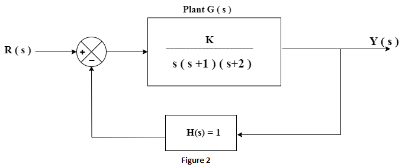
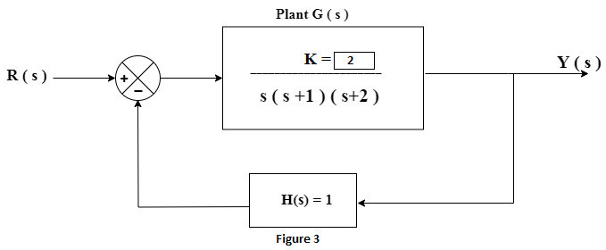
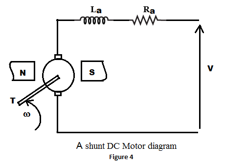

### Procedure

<h2>Unity feedback control system</h2>

          

								
								

<b>Steps to perform the simuation</b>
           

<b style="color:blue">Problem-1 ( Observe the response of a unity feedback system ( fig 1 ) for different values of &zeta; )</b>

1. At first click on "Problem 1" button and select the input signal ( Unit Step or Unit Impluse ). In the given unity feedback system, set the value of &zeta; ( damping ratio ) throuh the up-down arrows
in the input box in denominator of plant transfer function G ( s ).

2. &zeta; can be varied from 0 to 1. After the value of &zeta; is set click on the 'RUN' button to observe the system response for the particular input signal and &zeta value.

3. Click on 'Download Plot' button to download the response plot. Click on 'Ok' button.

4. Click on '3D-Plot' button then on either '3D Step' or '3D Impulse' ( depending on the type of input signal, chosen in step 1 )
to observe the 3D response plot for that particular input signal, where x-axis represents time (sec), y-axis represents &zeta; ( damping ratio ) and z-axis 
represents the system response. Click on 'Ok' button.

5. Change the value of &zeta; and repeat step 2-4.

           

<b style="color:blue">Problem-2 ( Plot the root loci for the unity feedback system ( fig 2 )</b>

1. At first click on "Problem 2" button and select the input signal ( Unit Step or Unit Impluse ). In the given unity feedback system, set the value of K ( gain ) throuh the up-down arrows
in the input box in numarator of plant transfer function G ( s ).</li> 

2. 'K' can be varied from 1 to 50. After the value of K is set click on the 'RUN' button, then on 'Root Locus' to observe the root locus plot of the system for that particular gain. The plot can be zoomed by selecting an area under the plot. Click on 'Ok' button to clear it.
Similarly, click on the 'RUN' button, then on 'Output Response' to observe the system response for the particular input signal and K value.

3. The plots can be downloaded by clicking on 'Download Plot' button. Click on 'Ok' button.

4. Change the value of gain K and repeat step 2-3.		
    

          

<b style="color:blue">Problem-3 ( Bode and Nyquist plot for the unity feedback system )</b>

1. At first click on "Problem 3" button and enter the desired range for angular frequency &omega; in the
input box below the block diagram. The plant transfer function G ( s ) is given.

2. Click on the 'RUN' button, then on 'Bode Plot' to observe the Bode plot of the system. The plot can be zoomed by selecting an area under the plot. Click on 'Ok' button to clear it.
Similarly, click on the 'RUN' button, then on 'Nyquist Plot' to observe the Nyquist plot of the system.

3. The plots can be downloaded by clicking on 'Download Plot' button. Click on 'Ok' button.

4. Observe the gain margin, phase margin, gain cross over frequency and phase cross over frequency.

5. Change the value of gain k and repeat step 2-4.

          

<b style="color:blue">Problem-4 ( System response of a Permanent Magnet DC Motor )</b>

1. At first click on "Problem 4" button and enter the desired value of supply voltage V. The dc motor circuit diagram is given.

2. Click on the 'RUN' button to observe the system response( speed(rad/s) vs. time ) as well as the motor armature current, speed, motor torque ( TM ), load torque ( TL ).

3. The plots can be downloaded by clicking on 'Download Plot' button. Click on 'Ok' button.

4. Change the value of supply voltage V and repeat step 2-3.	
                
      
